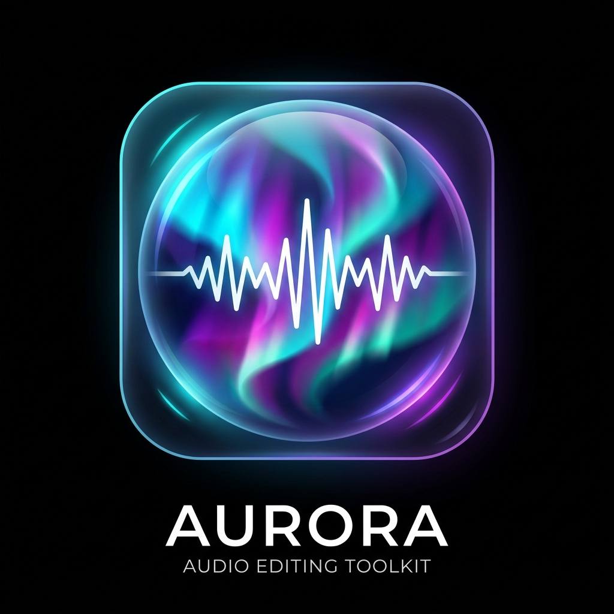

<div align="center">
  
  <h1>Aurora Music 🎵✨</h1>
  <p><strong>Your Ethereal Online Audio Toolkit</strong></p>

  [](https://vitejs.dev/)
  [](https://reactjs.org/)
  [](https://firebase.google.com/)
  
  <i>Create, Edit, and Transform Audio Locally In Your Browser</i>
</div>

---

## 🌌 Welcome to Aurora Music
Aurora Music is an advanced, client-side web application designed to help you transform your music and audio files without ever leaving your browser. 

Say goodbye to slow, server-based processing. Powered by the **Web Audio API** and **FFmpeg.wasm**, Aurora manipulates your files completely locally, ensuring top-tier privacy, blisteringly fast speeds, and uncompromised maximum audio quality. 

Whether you want to add an ethereal "Slowed + Reverb" vibe to a track, crank up the bass with a crossover filter, or craft spatial 3D audio effects—Aurora has you covered.

**[Try Aurora Music Live Here!](https://aurora-audio.web.app)**

## 🚀 Features

- **🎧 Ethereal Audio Effects**: Transform tracks with the custom **Slowed + Reverb** preset. Control room size, wet/dry mix, and playback speeds.
- **🔊 5-Band Equalizer & Bass Booster**: Take control of your sound with a professional 5-band EQ and an advanced bass booster with an adjustable crossover frequency.
- **🪐 Spatial 3D Audio**: Pan audio in an immersive 3D space with X and Z axis controls. Add the Haas Effect using fine-tuned Echo feedback and delay times.
- **🔄 Auto-Panner**: Create mesmerizing stereo movement with sine, triangle, or square wave LFOs.
- **🎙️ Converters & Extractors**: Uses `ffmpeg.wasm` for maximum quality conversions. Convert audio seamlessly to MP3, WAV, OGG, FLAC, and more.
- **📱 Progressive Web App (PWA)**: Installable directly on your mobile device or desktop. Fully responsive layout with beautiful, dynamic frosted-glass UI and fluid micro-animations.

## 🛠️ How It Was Made
Aurora Music was created to provide a completely client-side toolkit with premium audio capabilities. The architecture relies on:

1. **Web Audio API / OfflineAudioContext**: We built a custom `AudioEngine` graph routing system. Audio is streamed through a parallel effects graph including a Convolver Node for Reverb, Delay Nodes for Echoes, and BiquadFilters for the EQ and Bass crossover. Everything renders locally to an `OfflineAudioContext` for lightning-fast exporting in 32-bit float WAV format.
2. **FFmpeg.wasm**: WebAssembly implementation of FFmpeg handles format conversion without servers. It runs in the highest possible quality mode (`-q:a 0`).
3. **React + Vite**: A modern frontend framework for lightning-fast hot reloading and optimized production builds. 
4. **Framer Motion**: Used for the smooth, glassy interactions and ethereal animations that bring the UI to life. 

## 🧠 Credits
- **Concept & Vision**: Designed and ideated by [WhatTheHackkk](https://github.com/WhatTheHackkk).
- **Engineering & Implementation**: Built by Antigravity (Agentic AI Developer).

## 💻 Local Development

Want to run Aurora Music locally? 

```bash
# Clone the repository
git clone https://github.com/WhatTheHackkk/Aurora-Music.git

# Navigate into the project
cd Aurora-Music

# Install dependencies
npm install

# Start the dev server
npm run dev
```

## 📄 License
This project is open-source and free to use! Have fun transforming your audio.
